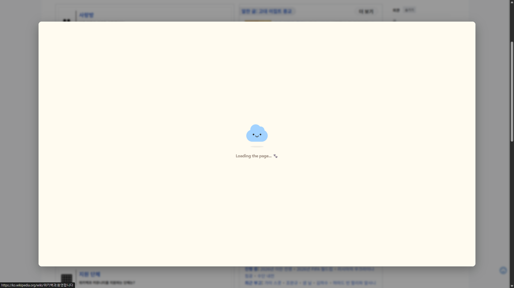
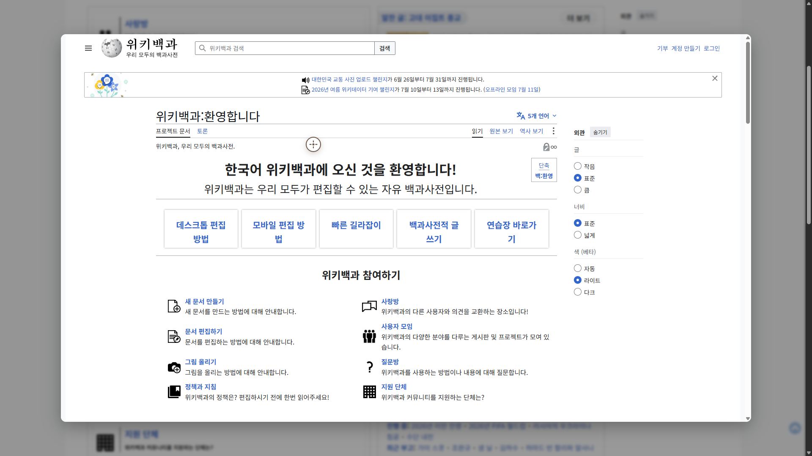
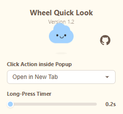

  

<h1 align="center">Wheel Quick Look ☁️</h1>

  마우스 휠을 길게 눌러 중앙 모달 팝업으로 링크를 미리 보고, 불필요한 탭 생성을 줄여주는 크롬 확장 프로그램입니다.

        

  <a href="./README.md">English</a> | 한국어

  
  

---

## Features

* **링크 미리보기**: 링크 위에서 마우스 휠(가운데 버튼)을 길게 누르면 중앙에 미리보기 팝업이 표시됩니다.
* **자동 스크롤 기능**: 팝업 내부를 마우스 휠로 클릭하면 자동 스크롤 모드가 활성화되며, 조준선(crosshair) UI와 페이지 로더가 표시됩니다.
* **내비게이션 제어**: 미리보기 내부를 클릭했을 때 설정에 따라 새 탭으로 열지, 아니면 현재 창을 전환할지 선택할 수 있습니다.
* **스크롤 위치 복원**: 이동한 페이지에서 이전의 정확한 가로/세로 스크롤 좌표를 자동으로 기억하고 복원합니다.
* **포커스 탈취 방지**: 팝업 내에서 사용자의 상호작용 레이아웃을 보호하기 위해 방해되는 광고 등을 격리합니다.
* **빠른 팝업 닫기**: `Escape` 키 입력, 어두운 백드롭 오버레이 클릭, 또는 마우스 뒤로 가기 버튼(버튼 3) 클릭 시 미리보기 모달이 즉시 닫힙니다.
* **사용자 정의 설정**: 확장 프로그램 제어판을 통해 길게 누르는 시간 임계값(200ms - 2000ms) 및 창 클릭 동작을 조절할 수 있습니다.
* **보안 및 로컬 저장**: 모든 설정은 `chrome.storage.local`을 사용하여 사용자의 로컬 컴퓨터에 안전하게 저장됩니다.

---

## Installation (Developer Mode)

본 확장 프로그램은 로컬 환경에 최적화되어 있으므로, 크롬의 개발자 모드를 통해 직접 실행할 수 있습니다:

1. 저장소를 로컬 컴퓨터로 clone 하거나 **[Download](https://github.com/Aiuces/chrome-wheel-quick-look/releases)** 링크를 클릭하여 다운로드합니다.
2. 다운로드한 `.zip` 파일의 압축을 풀고 로컬 컴퓨터의 영구적인 폴더(예: 문서 폴더)에 저장합니다. *크롬이 해당 경로의 확장 프로그램 파일을 직접 읽으므로, 설치 후 이 폴더를 삭제하지 마십시오.*
3. 구글 크롬을 열고 주소창에 `chrome://extensions/`를 입력하여 이동합니다.
4. 확장 프로그램 페이지 우측 상단의 **개발자 모드** 토글 스위치를 켭니다.
5. 좌측 상단의 **압축해제된 확장 프로그램 로드** 버튼을 클릭합니다.
6. 압축을 푼 폴더를 선택합니다. **중요:** `manifest.json` 파일이 바로 들어 있는 루트 디렉토리를 선택해야 합니다(폴더가 이중으로 중첩된 경우, 안쪽 폴더를 선택하세요).
7. 툴바에 **Wheel Quick Look**을 고정하여 편리하게 사용해 보세요!

> **코드 수정 시 주의사항:**  
> `content.js` 등의 소스 코드를 수정하는 경우, `chrome://extensions/` 페이지에서 확장 프로그램을 **반드시 새로고침**해야 하며, 변경 사항을 반영할 **활성화된 웹페이지 탭도 함께 새로고침**해야 합니다.

---

## Configuration

  

툴바의 확장 프로그램 아이콘을 클릭하여 제어판에 접속할 수 있습니다:
* **Click Action inside Popup**: 미리보기 내부를 클릭 시 새 탭으로 열지, 아니면 현재 화면을 전환할지 선택합니다.
* **Long-Press Timer**: 마우스 휠을 길게 누르는 시간 임계값(200ms - 2000ms)을 조절합니다.

---

## Advanced: Security & Compatibility (rules.json)

기본적으로 `rules.json`의 일부 고급 네트워크 규칙은 `disabled-` 접두사(예: `disabled-content-security-policy`)가 붙어 비활성화되어 있습니다.

* **기본 비활성화 사유**: 웹사이트의 보안 헤더(`Content-Security-Policy`, `X-Frame-Options`)를 무조건적으로 제거하는 것은 사용자에게 보안 리스크(클릭재킹 등)를 유발할 수 있기 때문입니다.
* **발생하는 현상**: 규칙이 비활성화된 상태이기 때문에, 자체적으로 iframe 로드를 거부하는 일부 엄격한 사이트들은 미리보기 팝업에서 "연결 거부(Connection Refused)" 오류가 발생합니다.
* **사용 방법**: 특정 사이트의 미리보기가 꼭 필요하다면, 해당 규칙에서 `disabled-` 접두사를 제거하여 프레임 제한을 우회할 수 있습니다. 
* **보안 경고**: 이 규칙을 활성화(접두사 제거)하면 미리보기 컨텍스트 내에서 엄격한 보안 헤더(`Content-Security-Policy` 및 `X-Frame-Options`)가 강제로 제거됩니다. 이러한 처리는 웹사이트 호환성을 향상시키지만, 신뢰할 수 없는 사이트에서는 <strong>미리보기 샌드박스가 잠재적인 보안 취약점에 노출될 수 있습니다.</strong> 신중하게 사용하십시오.

---

## License

Copyright (c) 2026 Aiuces. All rights reserved.  

본 프로젝트는 엄격한 <strong>개인적 비상업용 및 재배포 금지 라이선스(Custom Non-Commercial & Anti-Redistribution License)</strong>에 따라 라이선스가 부여됩니다. 자세한 내용은 [LICENSE](LICENSE) 파일을 참조하십시오. 모든 상업적 이용 및 웹스토어 무단 재게시를 엄격히 금지합니다.
